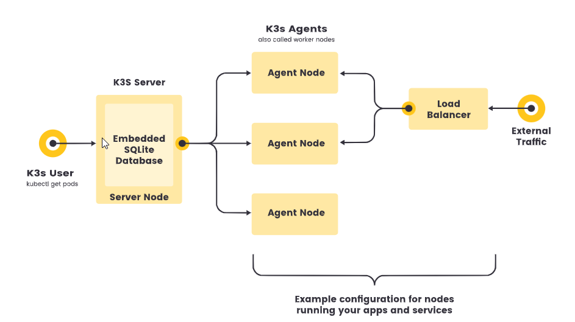

# K3s

Project to configurate k3s cluster using terraform and ansible


## Minimum Requirements

- RAM: 1G
- CPU: 1 Minimum

## Networking


|Protocol|	Port |	Source |	Description |
|--------|-------|---------|--------------|
|TCP	|6443	|K3s agent nodes	|Kubernetes API Server|
|UDP	|8472	|K3s server and agent nodes	|Required only for Flannel VXLAN|
|UDP	|51820	|K3s server and agent nodes	|Required only for Flannel Wireguard backend|
|UDP	|51821	|K3s server and agent nodes	|Required only for Flannel Wireguard backend with IPv6|
|TCP	|10250	|K3s server and agent nodes	|Kubelet metrics|
|TCP	|2379-2380	|K3s server nodes	| Required only for HA with embedded etcd|

## Architecture

### Single Server



## Quick-Start Guide

### Azure provisioning

```bash

cd ./azure
terraform apply --auto-approve

```
## Docs

https://docs.k3s.io/
https://docs.k3s.io/installation/requirements
